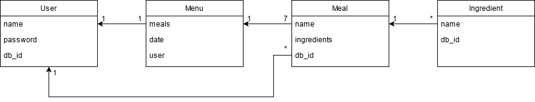
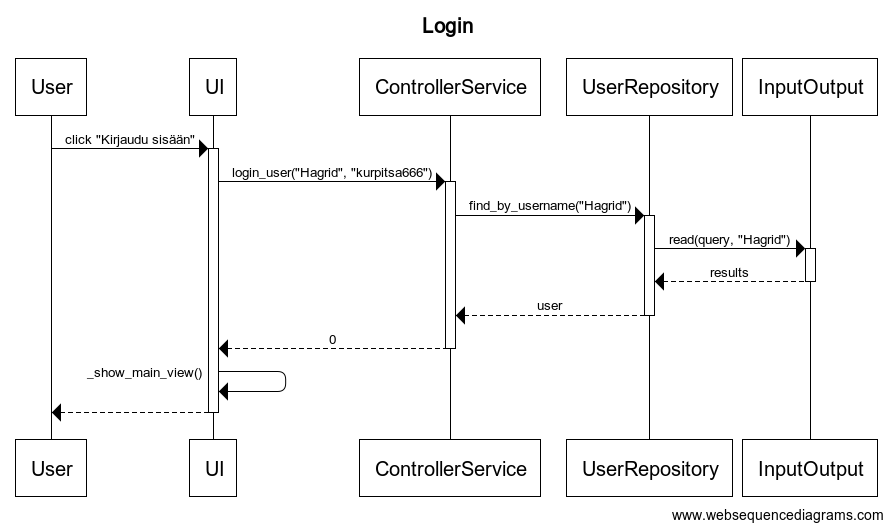
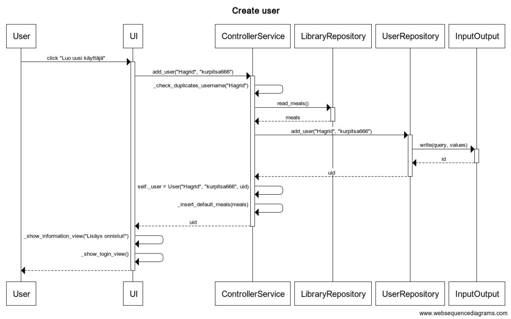
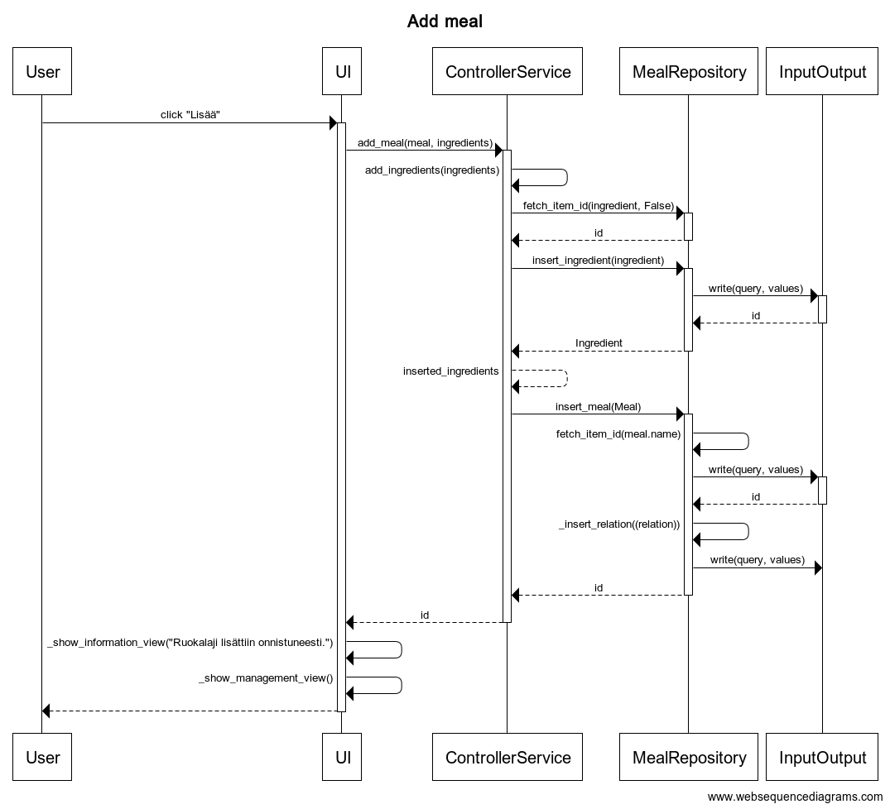
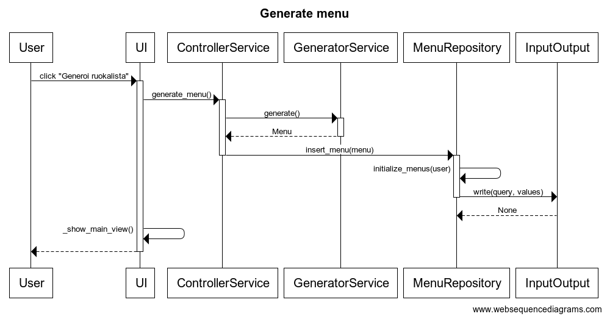

# Arkkitehtuurikuvaus

## Rakenne

Ohjelman rakenne noudattaa kolmitasoista kerrosarkkitehtuuria. Sovelluksen koodin pakkausrakenne on seuraavanlainen:


Pakkaus `ui` sisältää sovelluksen käyttöliittymään liittyvän koodin, `services` sovelluslogiikkaan liittyvän koodin, `repositories` tietojen tallentamiseen liittyvän koodin ja `entities` sisältää sovelluksen tietokohteet.

## Käyttöliittymä

Käyttöliittymä sisältää seitsemän erilaista näkymää:
- Kirjautuminen
- Uuden käyttäjän luominen
- Päänäkymä, jossa on mm. ruokalistan katselu ja generointi
- Kirjastojen hallinta
    - Ruokalajin poiston varmistaminen
- Infonäkymä, joka viestii käyttäjälle toimenpiteiden suorituksista
- Kauppalistan tarkastelu ja tallennus

Jokainen näkymä on toteutettu omassa luokassaan. Näkymien välillä vaihdellaan [`UI`](https://github.com/P3Xu/ot-harjoitustyo/blob/master/src/ui/ui.py)-luokasta käsin siten, että parhaillaan käytössä oleva näkymä pyytää `UI`-luokalta parametrina saamastaan listasta haluamaansa näkymää ja `UI`-luokka vaihtaa pyydetyn näkymän edellisen tilalle. Näkyvillä on vain yksi näkymistä kerrallaan.
`UI`-luokka antaa jokaiselle näkymälle parametrina listan, joka sisältää kaikki sovelluksen muut näkymät, sekä viittauksen myös itseensä. Tällöin uusien näkymien tapauksessa riittää liittää uusi näkymä vain `UI`-luokkaan ja sen listaan.
Käyttöliittymä on pyritty pitämään erillään sovelluslogiikasta ja näin ollen käyttöliittymä ainoastaan käyttää [`Controller`](https://github.com/P3Xu/ot-harjoitustyo/blob/master/src/services/controller.py)-luokan tarjoamia palveluja.
Käyttöliittymä toimii siten, että kaikkien interaktioiden yhteydessä ladataan näkymä uusiksi, jolloin interaktiosta mahdollisesti aiheutuneet päivitykset sovelluksen tietoihin päivittyvät näkymiin välittömästi. 

## Sovelluslogiikka

Sovelluksen tietomallia kuvaa seuraava kaavio:



Tietomalli koostuu luokista [`User`](https://github.com/P3Xu/ot-harjoitustyo/blob/master/src/entities/user.py), [`Menu`](https://github.com/P3Xu/ot-harjoitustyo/blob/master/src/entities/menu.py), [`Meal`](https://github.com/P3Xu/ot-harjoitustyo/blob/master/src/entities/meal.py) ja [`Ingredient`](https://github.com/P3Xu/ot-harjoitustyo/blob/master/src/entities/ingredient.py). Nämä luokat kuvaavat käyttäjiä, käyttäjien ruokalistoja, käyttäjien ja ruokalistojen ruokalajeja, sekä ruokalajien raaka-aineita.

Sovelluksen toiminnallisista kokonaisuuksista vastaavat luokat [`ControllerService`](https://github.com/P3Xu/ot-harjoitustyo/blob/master/src/services/controller.py) ja [`GeneratorService`](https://github.com/P3Xu/ot-harjoitustyo/blob/master/src/services/generator.py). `GeneratorService` tarjoaa Controllerille ruokalistan generointitoiminnallisuuden `generate()`-metodillaan. `ControllerService` puolestaan tarjoaa käyttöliittymälle kaiken sen tarvitseman toiminnallisuuden sovelluksen toimintoihin, muun muassa seuraavin metodein:
- `add_ingredients(ingredients)`
- `add_meal(meal, ingredients)`
- `add_user(username, password, config_file)`
- `fetch_ingredients()`
- `fetch_meals()`
- `fetch_menus()`
- `login_user(username, password)`

Pääsyn pysyväistallennettuihin tietoihin Controllerille tarjoaa repository-luokat [`LibraryRepository`](https://github.com/P3Xu/ot-harjoitustyo/blob/master/src/repositories/library_repository.py), [`MealRepository`](https://github.com/P3Xu/ot-harjoitustyo/blob/master/src/repositories/meal_repository.py), [`MenuRepository`](https://github.com/P3Xu/ot-harjoitustyo/blob/master/src/repositories/menu_repository.py) ja [`UserRepository`](https://github.com/P3Xu/ot-harjoitustyo/blob/master/src/repositories/user_repository.py).

Sovelluksen pakkausten ja luokkien väliset suhteet kaaviona seuraavassa luokka/pakkauskaaviossa:


## Tiedon pysyväistallennus

Tiedon pysyväistallennuksesta huolehtivat `repositories`-pakkauksen luokat [`LibraryRepository`](https://github.com/P3Xu/ot-harjoitustyo/blob/master/src/repositories/library_repository.py), [`MealRepository`](https://github.com/P3Xu/ot-harjoitustyo/blob/master/src/repositories/meal_repository.py), [`MenuRepository`](https://github.com/P3Xu/ot-harjoitustyo/blob/master/src/repositories/menu_repository.py) ja [`UserRepository`](https://github.com/P3Xu/ot-harjoitustyo/blob/master/src/repositories/user_repository.py). Tietokantaa käsittelevät repository-luokat käyttävät erillistä [`InputOutput`](https://github.com/P3Xu/ot-harjoitustyo/blob/master/src/repositories/io.py)-luokkaa tietokannan lukemiseen ja kirjoittamiseen. I/O-luokka on mahdollista injektoida repository-luokille, mutta sovelluksessa luokat käyttävät omia riippuvuuksiaan. `LibraryRepository` lukee käyttäjien ruokalajien oletuskirjastoja CSV-muodossa ja tulostaa kauppalistoja tekstitiedostoihin, eli `.txt`-muodossa. Tietokantana sovelluksessa toimii SQLite-tietokanta.

Luokat on toteutettu [Repository](https://docs.microsoft.com/en-us/dotnet/architecture/microservices/microservice-ddd-cqrs-patterns/infrastructure-persistence-layer-design)-suunnittelumallia noudattaen, jolloin sovelluksen tiedon pysyväistallennus on saatu helposti abstraktoitua sovelluslogiikalta ja sovellukseen on näin ollen helppo liittää tai vaihtaa toisenlaisia moduuleja tiedon tallennukseen.

Tietokannan tauluja ja relaatioita kuvaa tietokantakaavio:


### Tiedostot

Sovelluksen tietokanta tallennetaan [`.env`](https://github.com/P3Xu/ot-harjoitustyo/blob/master/.env)-nimisessä konfiguraatiotiedostossa määriteltyyn tiedostoon [`data`](https://github.com/P3Xu/ot-harjoitustyo/tree/master/data)-hakemistossa. Tämän lisäksi sovellus luo oletusarvoisesti (mikäli ei konfiguraatiossa muutettu) `default.csv`-nimisen CSV-tiedoston, josta luetaan kaikille uusille käyttäjille ruokalajien oletuskirjasto, mikäli käyttäjä ei tunnusta luodessaan lataa omaa käytettävää tiedostoa. Ruokalajit tulee olla tiedostoissa muodossa _ruokalaji;raaka-aine_, esimerkiksi siis:

```
Lihaa ja perunaa;Liha
Lihaa ja perunaa;Peruna
Kalapuikkoja;Kalapuikot
```

Sovelluksen tarvitsemat tietokantataulut ja oletuskirjasto-tiedosto alustetaan tiedostoissa [init_database](https://github.com/P3Xu/ot-harjoitustyo/blob/master/src/init_database.py) ja [init_default_set](https://github.com/P3Xu/ot-harjoitustyo/blob/master/src/init_default_set.py).

## Päätoiminallisuus 

Sovelluksen päätoiminnallisuus kiteytyy käyttäjän luomiseen ja sisäänkirjautumiseen, ruokalajien ja raaka-aineiden hallinnointiin, ruokalistan generointiin sekä kauppalistan koostamiseen generoidun ruokalistan raaka-aineista. Ohessa on kuvattu osaa näistä toiminnallisuuksista sekvenssikaavioiden muodossa.

### Sisäänkirjautuminen

Sisäänkirjautumisnäkymä on ensimmäinen, joka käyttäjän näkyville avautuu kun sovellus käynnistetään. Näkymässä on kentät käyttäjätunnukselle ja salasanalle, sekä lisäksi on painikkeet ohjelman lopettamiselle tai uuden käyttäjän luomiselle. Kun kenttien tiedot on täytetty ja painetaan _Kirjaudu sisään_-painiketta, etenee sovelluksen toiminta kuvatunlaisesti:



Näkymän prosessointimetodi pyytää `ControllerServicelta` —tästedes pelkkä `Controller`— metodia `login_user` parametreinaan käyttäjätunnus ja salasana. `Controller` pyytää `UserRepositorylta` metodilla `find_by_username` kyseisen käyttäjän tietoja ja vertaa, täsmäävätkö ne. `UserRepository` pyytää `InputOutputia` lukemaan tietokannasta kyseiseen käyttäjätunnukseen liittyvän rivin. Mikäli kaikki luokat palauttavat oikeanlaisen paluuarvon, vaihtaa `UI` käyttäjän näkyville sovelluksen päänäkymän.

### Uuden käyttäjän luominen

Käyttäjän lisäämisnäkymässä on kentät halutulle käyttäjätunnukselle, sekä salasanalle. Lisäksi on mahdollisuus ladata oma vakioruoka-kirjasto CSV-muotoisena, mikäli halua käyttää järjestelmän oletusruokia. Kun vaaditut tiedot on syötetty ja painetaan _Luo käyttäjä_-painiketta, etenee sovelluksen toiminta seuraavalla tavalla:



Näkymän prosessointimetodi pyytää `Controllerilta` metodia `add_user` parametreinaan käyttäjän valitsema käyttäjätunnus, salasana sekä mahdollinen config-tiedosto vakioruokalajeille. `Controller` tarkistaa, ettei samannimistä käyttäjää ole jo olemassa ja checkin ollessa kunnossa pyytää `LibraryRepositorya` lukemaan vakioruokalajit joko käyttäjän antamasta tai sitten oletustiedostosta. Tämän jälkeen `Controller` pyytää `UserRepositorya` lisäämään käyttäjän tietokantaan, joka puolestaan pyytää `InputOutputia` kirjoittamaan tietokantaan oikean rivin. `InputOutput` palauttaa lisätyn rivin id-numeron, jonka `UserRepository` välittää suoraan `Controllerille`. Joka id:n saatuaan asettaa omaan [user-attribuuttiinsa](https://github.com/P3Xu/ot-harjoitustyo/blob/5ce43090a4ffc391c31ebb89fcdee1e51282a21a/src/services/controller.py#L38) arvoksi kyseisen käyttäjän ilmentymän. Tämän jälkeen `Controller` pyytää omaa `insert_default_meals`-metodiaan lisäämään käyttäjälle oletusruoat tietokantaan. Ruokien lisääminen on kuvattu jäljempänä tulevassa sekvenssikaaviossa, joten se on jätetty tästä kaaviosta pois. Lopuksi `Controller` palauttaa `UI`:lle käyttäjän saaman tietokanta-id:n. `UI` vaihtaa käyttäjälle onnistuneesta lisäyksestä kertovan näkymän ja siirtyy aikakatkaisun jälkeen kirjautumisnäkymään.

### Ruokalajin lisääminen

Ruokalajien hallintanäkymässä on kentät uudelle ruokalajille ja sen raaka-aineille. Kentät oikeilla arvoilla täytettyä ja _Lisää_-painiketta painettua etenee sovelluksen toiminta seuraavasti:



Näkymän prosessointimetodi pyytää `Controllerilta` metodia `add_meal` parametreinaan ruokalajin nimi, sekä raaka-aineet listana. `Controller` kutsuu omaa metodiaan `add_ingredients` joka saa parametrina tuon raaka-aineiden listan, jonka metodi iteroi yksi kerrallaan läpi. Ensiksi iteraatiossa tarkistetaan tietokannasta, onko samannimistä raaka-ainetta jo olemassa. Mikäli on, liitetään palautettavaan listaan vain suoraan raaka-aineen ilmentymä, jolle annetaan paluuarvona saatu id-numero ja mikäli ei ole, lisätään ruoka tietokantaan ja sen jälkeen palautettavaan listaan lisätään ilmentymä, jonka db_id:n arvoksi tulee juuri saatu id. Eli `Controller` kysyy `MealRepositorylta` metodilla `fetch_item_id` tuota olemassaoloa ja sen jälkeen pyytää `MealRepositorya` lisäämään raaka-aineen kantaan, mikäli fetchaus palautti Nonen. `MealRepository` pyytää `InputOutputia` kirjoittamaan rivin kantaan ja I/O palauttaa kirjoitetun rivin id-numeron, jonka `MealRepository` välittää `Controllerille`. Kun iteraatio on suoritettu, palauttaa metodi sitä kutsuneelle `add_meal`-metodille listallisen raaka-aineiden ilmentymiä, joilla on siis tietokannan id-numerot mukaan liitettynä. Tämän jälkeen metodi syöttää kyseisen ruokalajin ilmentymän `MealRepositorylle`, joka tekee samanlaisen duplikaatin tarkistuksen ja jos samanniminen ruokalaji on jo olemassa, käytetään vain suoraan sen id-numeroa. `MealRepository` pyytää `InputOutputia` lukemaan ja kirjoittamaan tarvittavat tietokantakomennot, sekä lopuksi vielä iteroi lisättävien relaatioiden kirjoittamisen tietokantaan. Tämänkin `MealRepository` pyytää `InputOutputilta`. Paluuarvona kulkee lopulta viimeisimmän tietokannassa kirjoitetun rivin id. Mikäli `Controller` palauttaa kokonaisluvun eli tuon id-numeron, vaihtaa `UI` käyttäjälle viestinäkymän joka kertoo, onnistuiko lisäys vai ei. Lopuksi tilalle vaihdetaan takaisin hallintanäkymä.

### Ruokalistan generointi

Päänäkymässä on painikkeita erilaisille toiminnoille. Kun niistä painetaan _Generoi ruokalista_-painiketta, tapahtuu sovelluksessa seuraavaa:



Näkymän prosessointimetodi pyytää `Controlleria` generoimaan ruokalistan. `Controller` puolestaan pyytää tätä `GeneratorServicelta`, joka arpoo ruokalistan ja palauttaa sen ilmentymän `Controllerille`. Tämän jälkeen `Controller` pyytää `MenuRepositorya` tallentamaan kyseisen ruokalistan tietokantaan, joka pyytää `InputOutputia` kirjoittamaan siihen liittyvät rivit `menus`-tauluun, kunhan on ensin pyytänyt omaa [`initialize_menus`](https://github.com/P3Xu/ot-harjoitustyo/blob/5ce43090a4ffc391c31ebb89fcdee1e51282a21a/src/repositories/menu_repository.py#L70)-metodiaan pyyhkimään taulusta käyttäjän aikaisemman ruokalistan, mikäli sellainen on olemassa. Tässä tapauksessa luokkien välillä ei kulje minkäänlaisia paluuarvoja, vaan seuraavaksi `UI` vaihtaa käyttäjän näkyville uudestaan päänäkymän, jolloin ruokalistan kohdalla näkyy viimeisin generoitu ruokalista.

### Muut toiminnallisuudet

Sovelluksen pakkausrakenteesta johtuen kaikki toiminnallisuudet toimivat samalla periaatteella. Käyttöliittymän interaktiiviset komponentit laukaisevat prosessointimetodin, joka kutsuu `Controllerilta` tarvittavaa metodia, joka kutsuu tarvittavia _repository_-luokkia. Lopuksi kontrolli palaa käyttöliittymälle, johon vaihtuu yleensä seuraavaksi näkymäksi interaktion onnistumisesta raportoiva viestinäkymä ja sitten seuraava näkymä. 

## Ohjelman rakenteeseen jääneet heikkoudet

Käyttöliittymä saattaa olla paikoin hieman epäintuitiivinen, sekä käytettävästä ympäristöstä riippuen jotkin käyttöliittymän komponentit eivät välttämättä näy oikein. Esimerkiksi hyvin pieniresoluutioisella näytöllä varsinkin hallintanäkymässä saattaa jäädä painikkeet piiloon. Lisäksi tkinterin ominaisuuksiin vaikuttaa kuuluvan sellainen, että sovelluksen näkymät aukeavat ruudulla mihin sattuu. Myöskin ikkunan _resize_ saattaa saada näkymän sekaisin, kun palaa _maximized_-tilasta takaisin normaaliin. Lisäksi kauppalistan tallennushakemistoa valittaessa, mikäli painaa _cancel_, saattaa tulostua virheviesti, jonka on tarkoitus tulostua vain yritettäessä tallentaa hakemistoon, johon ei ole kirjoitusoikeuksia.

Lisäksi yksittäisiä ruokalajeja ei pääse tällä hetkellä käsittelemään erikseen. Käyttöliittymästä ei siis ole esimerkiksi mahdollista nähdä, mitkä raaka-aineet liittyvät mihinkin ruokalajiin.
