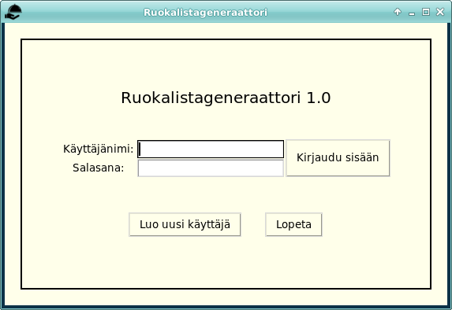
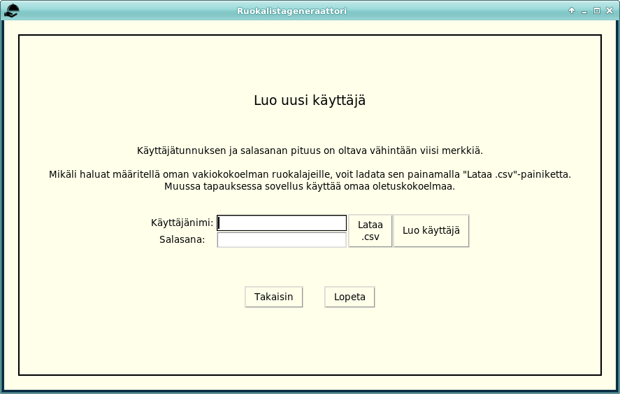
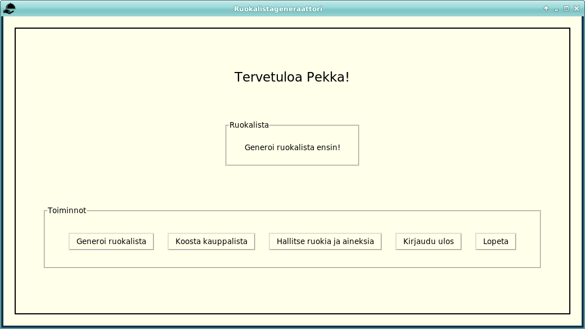
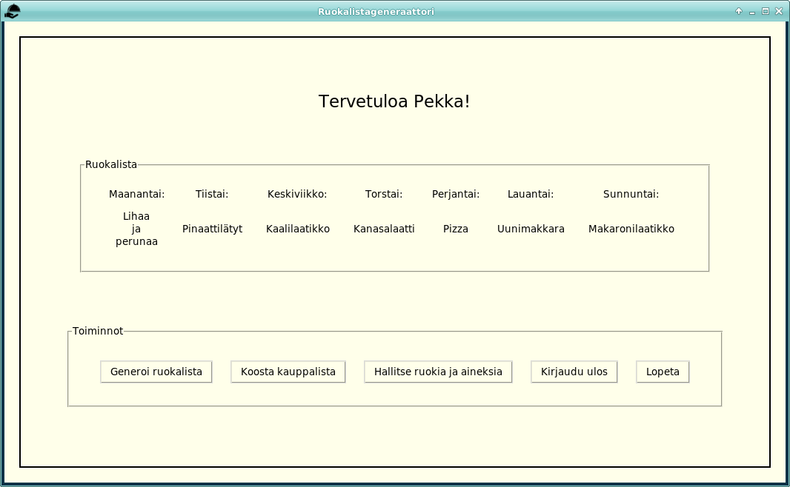
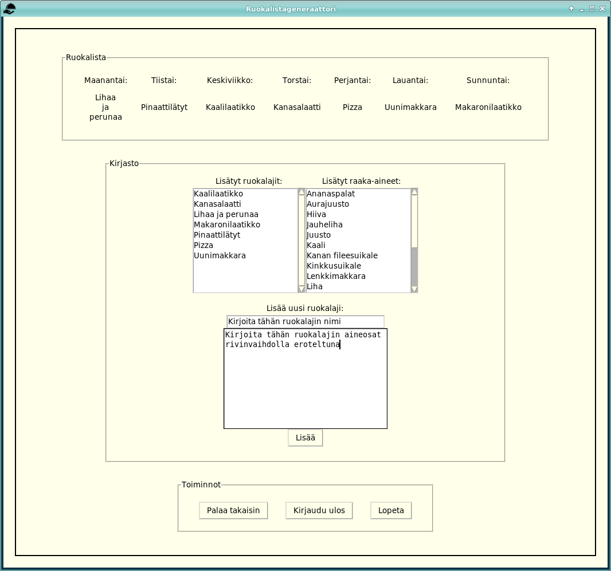
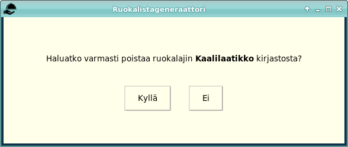
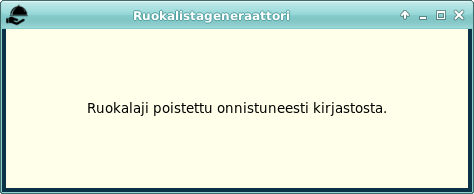

# Käyttöohje

Lataa projektin viimeisin [release](https://github.com/P3Xu/ot-harjoitustyo/releases/) valitsemalla joko _Source code(zip)_ tai _Source code(tar.gz)_ _Assetsin_ alta.

## Konfigurointi

Sovellus on konfiguroitu valmiilla oletusarvoilla, joita on mahdollista muuttaa [`.env`](https://github.com/P3Xu/ot-harjoitustyo/blob/master/.env)-tiedostossa. Tiedoston arvot ovat seuraavat:
- `DATABASE_FILENAME=food.db`, käytettävän tietokantatiedoston nimi. Tiedosto luodaan automaattisesti _data_-hakemistoon suorittamalla _build_.
- `DEFAULT_SET_FILENAME=default.csv`, käytettävän vakioruokakirjaston nimi. Tämäkin tiedosto luodaan automaattisesti, mikäli samannimistä tiedostoa ei vielä ole.
- `ICON_NAME=icon.png`, sovellusikkunan ikoni, jonka voi halutessaan vaihtaa tai poistaa kokonaan. Ikonin on sijaittava _src_-hakemistossa.
- `MESSAGE_SHOWTIME=4500` viestinäkymän esiintymisen kesto millisekunteina. Oletuksena siis 4,5 sekuntia.

Mikäli halutaan käyttää kaikille sovelluksen uusille käyttäjille sovelluksen omasta vakiokirjastosta eroavaa ruokalajien oletuskirjastoa, voidaan ruokalajit korvata joko olemassaolevaan CSV-tiedostoon. Tai sitten kirjoittaa kokonaan uusi tiedosto ja vaihtaa konfiguraatiotiedostoon kyseisen CSV-tiedoston nimi. Oletusruokalajit on mahdollista poistaa omasta kirjastostaan sisäänkirjautumisen jälkeen, CSV-tiedosto määrittää siis vain käyttäjän luomisen yhteydessä käyttäjälle lisättävät vakioruokalajit.

## Ohjelman käynnistäminen

Ennen ohjelman käynnistämistä tulee asentaa ohjelman riippuvuudet komennolla:

```shell
poetry install
```

Lisäksi tulee suorittaa projektin alustustoimet komennolla:

```shell
poetry run invoke build
```

Näiden toimenpiteiden jälkeen sovelluksen voi käynnistää komennolla:

```shell
poetry run invoke start
```

## Kirjautuminen

Sovelluksen ensimmäinen näkymä on kirjautumisnäkymä. 
Sovellukseen kirjaudutaan syöttämällä käyttäjätunnus ja salasana, jonka jälkeen voidaan painaa "Kirjaudu sisään" -painiketta.



## Käyttäjän lisääminen

Kirjautumisnäkymästä pääsee luomaan uutta käyttäjää klikkaamalla "Luo uusi käyttäjä" -painiketta. Uudelle käyttäjälle määritellään käyttäjänimi sekä salasana. Lisäksi voi ladata CSV-muotoisen ruokalajikirjaston, josta luetaan vakioruokalajit käyttäjän tietokantaan. Lopuksi painetaan "Luo käyttäjä" -painiketta. Onnistuneen lisäyksen jälkeen sovellus palaa kirjautumisnäkymään. Muussa tapauksessa sovellus huomauttaa vikaan menneestä lisäyksestä ja palaa takaisin luontinäkymään.
CSV-tiedostossa ruokalajien tulee olla muodossa _ruokalaji;raaka-aine_ ja rivinvaihdoilla eroteltuna. Esimerkiksi:

```
Lihaa ja perunaa;Liha
Lihaa ja perunaa;Peruna
pinaattilätyt;pinaatti
pinaattilätyt;kananmuna
pinaattilätyt;vehnäjauho
pinaattilätyt;maito
Kalapuikot;kalapuikko
```



## Sovelluksen käyttäminen

### Päänäkymä

Kirjautumisen jälkeen näkyy päänäkymä josta löytyy viikon ruokalista, mikäli sellainen on jo generoitu. Lisäksi on muihin toiminnallisuuksiin ohjaavat painikkeet, joista voi luoda uuden ruokalistan, tulostaa viikon kauppalistan, hallita ruokalajikirjastoa sekä kirjautua ulos tai sulkea sovelluksen _Lopeta_-painikkeella.

Ruokalistan generoimiseen tarvitsee kirjastossa olla vähintään seitsemän eri ruokalajia. Mikäli tämä ehto ei täyty, sovellus huomauttaa asiasta.





### Kauppalistan tulostaminen

Kauppalistanäkymässä näkyy viikon ruokalista, sekä siihen liittyvät raaka-aineet eli kauppalista, jonka voi tulostaa haluamaansa hakemistoon tekstitiedostona. Näkymästä pääsee palaamaan takaisin, kirjautumaan ulos tai sitten voi lopettaa ohjelman.


### Kirjaston hallinta

Kirjastojen hallinnassa voi tarkastella jo lisättyjä ruokalajeja tai raaka-aineita scrollaamalla niiden kenttiä. 

#### Poistaminen

Kirjastosta voi poistaa ruokalajeja tuplaklikkaamalla ruokalajilistasta haluttua ruokalajia. Ohjelma varmistaa käyttäjältä, haluaako tämä varmasti poistaa kyseisen ruokalajin. Mikäli poistettuun ruokaan liitettyjä raaka-aineita ei ole muissa kirjaston ruokalajeissa, poistuvat myös ne samalla näkymästä.

#### Editointi

Sovelluksen 1.0 versiossa ei ole suoranaisesti mahdollista editoida ruokalajia. Olemassaolevaan ruokalajiin pystyy lisäämään raaka-aineita kirjoittamalla nimi-kenttään olemassaolevan ruokalajin nimen, sekä kirjoittamalla raaka-ainekenttään lisättävän raaka-aineen nimen. Tällöin uusi raaka-aine liittyy olemassaolevaan ruokalajiin myös vanhojen raaka-aineiden säilyessä liittyneenä. Raaka-aineiden poisto onnistuu toistaiseksi vain poistamalla koko ruokalaji.

#### Lisääminen

Kirjastoon voi myös lisätä uuden ruokalajin ja sen raaka-aineet syöttämällä ne "Lisää uusi ruokalaji:"-kohdan merkittyihin kenttiin. Kenttien oletustekstit katoavat kenttiä klikattaessa. Raaka-aineet tulee erotella toisistaan rivinvaihdoilla tähän tyyliin:

Kinkku
Kerma
Pasta

Kumpaakaan kenttää ei voi jättää tyhjäksi, tai lisääminen ei onnistu. Lopuksi painetaan "Lisää" -painiketta, jolloin näkyviin ilmestyy ikkuna, joka kertoo, onnistuiko lisääminen. 

Alhaalla on painikkeet, joista pääsee takaisin päänäkymään, voi kirjautua ulos tai voi lopettaa sovelluksen käytön. "Lopeta" -painike sulkee sovelluksen.





Sovellus tulostaa käyttäjälle erilaisia viesti-ikkunoita, joissa kerrotaan, kuinka suoritettu toimenpide sujui. Viesti-ikkunoiden runko on kaikissa tapauksissa sama, ainoastaan koko ja teksti vaihtuvat.



Kirjautumalla ulos sovellus palaa takaisin alkuperäiseen näkymään, josta pääsee kirjautumaan sisään sovellukseen.
